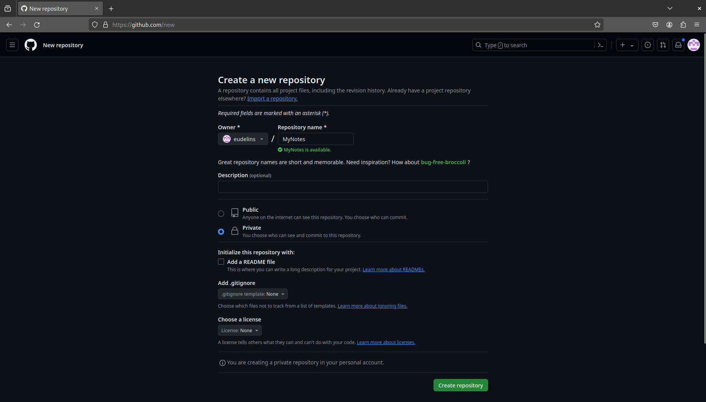
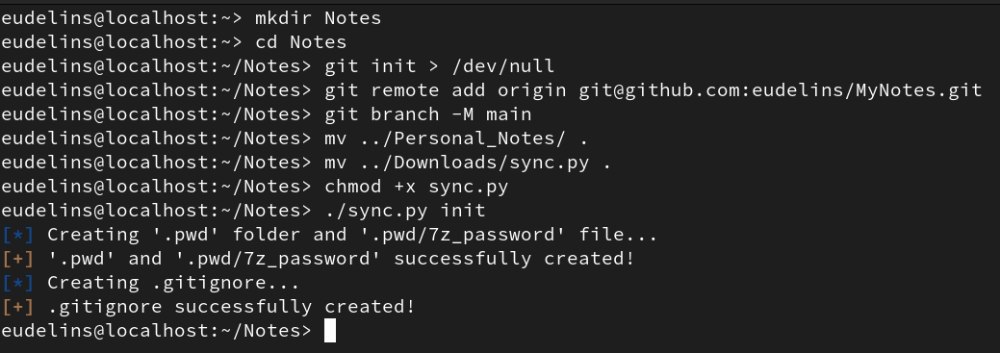

# Syncrypt

A Python script to automatically synchronized your obsidian Notes (encrypted), using GitHub.

## System dependencies

`7z`, `git` and `python3` must be installed on your machine (only tested with Python 3.11.9!).


## Init

First, you must create a private repository on GitHub (or other plateform alike):




Then, you must create an empty directory on your local machine run the traditional commands to init the repository:

```bash
cd $PROJECT_FOLDER
git init
git branch -M main
git remote add $PRIVATE_REPO_URL
```

Import this Python script at the root of this folder, with your Obsidian vaults to sync:

```
private_git_project_folder/
├─ .git/
├─ sync.py
├─ Obsidian_Vault1/
│  ├─ .obsidian/
│  ├─ Note.md
│  ├─ ...
├─ Obsidian_Vault2/
├─ ...
```

Then, use the following command to init the password for the encrypted archives that will be created:

```bash
python3 sync.py init
```

Of course, the password is created in a folder that is part of the `.gitignore` so it is not pushed to the remote repo and is only stored locally.

Here is a screenshot that summarize these steps:



## Push your changes

Once the init step is done, you can push your changes with the following command:

```bash
python3 sync.py push
```

## Pull your changes

First, you need to clone the directory from your GitHub and import the password use for the encryption inside the cloned folder:

```bash
git clone $PRIVATE_REPO_URL
cd $FOLDER_NAME
mkdir .pwd
echo $PASSWORD > .pwd/7z_password
```

Then, you can use the pull command of the tool:

```bash
python3 sync.py pull
```
